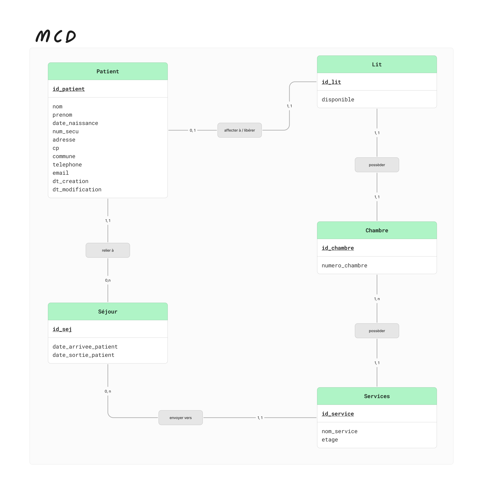
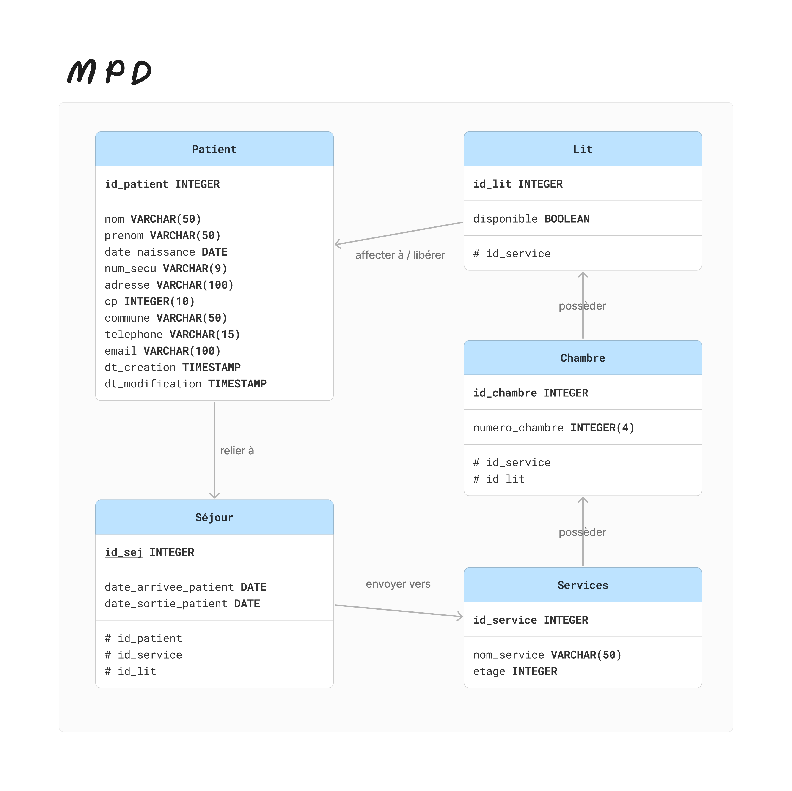

# **ECF_App_Hopital** 🏥

(sprint 1)

**Description :**\
_Il s’agit d’une application de gestion des séjours de patients dans un hôpital, permettant l'ajout, la modification et le suivi des patients et de leurs séjours. Le système assure la gestion des services hospitaliers, des lits et des chambres, avec la possibilité d'admettre et de libérer les patients, ainsi que d'affecter les lits selon les besoins._

## **-----------| MERISE |**

_Le système a pour objectif de gérer les patients hospitalisés depuis leur admission jusqu'à leur sortie:_
_Les entités principales comprennent l'administrateur, les patients, les séjours, les services, les lits et les chambres._

_Les règles métier incluent la gestion des admissions et des sorties, ainsi que l'affectation des patients aux services et aux lits, et la libération de la chambre (donc du lit) à la sortie d'un patient._

_Les fonctionnalités principales sont la gestion des patients (ajout et modification), la gestion des séjours (arrivée et sortie) et l'affectation des patients aux services et aux lits._

_Chaque entité est caractérisée par des attributs spécifiques, tels que l'identifiant, le nom, la date, etc qui définissent leurs propriétés et relations_

**En détail :**

**Entités principales:**

- Patient: Individu pris en charge par l'hôpital,
- Séjour: Période d'hospitalisation d'un patient,
- Service: Unité de soins de l'hôpital,
- Lit: Unité d'hébergement d'un patient dans un service,
- Chambre: Unité d'hébergement d'un ou plusieurs lits

**Règles métier principales:**

- Un nouveau patient peut être ajouter,
- Un patient existant peut être modifier,
- Un patient peut avoir plusieurs séjours,
- L'arrivée d'un patient dans un service peut être prise en compte,
- Un patient peut être envoyé un service,
- Un service possède plusieurs chambres,
- Une chambre possède un seul lit,
- Un lit est affecté à un seul patient
- La sortie d'un patient peut être prise en compte,
- Au départ du patient, la chambre (et donc le lit) est libéré.

**Fonctionnalités principales:**

- Gestion des patients (ajout, modification),
- Gestion des séjours (admission, sortie),
- Affectation des patients aux services et aux lits,
- Libérer la chambre à la sortie d'un patient.

### Dictionnaire de données

### MCD

### MPD

### MLD

---

## **-----------| UML |**

### Règles de gestion :

**Acteur :**

C'est l'Administrateur qui s’occupe de la gestion des patients, des séjours et des lits dans les quatres services de l’hopital

**Conditions :**

- L’hôpital contient quatre services : Service-1, Service-2, Service-3 et Urgences
- Chaque Service est composé de 10 chambres
- Et chaque chambre contient 1 seul lit
- Un patient doit exister dans la base de données pour que son arrivée soit prise en compte et ainsi être affecter à un lit dans le service concerné

**Action :**
On peut…

- Ajouter un nouveau patient : les données clients seront stockées dans la base de données
- Modifier un patient existant : il faut accéder à la base de données pour vérifier l’existence d’un patient pour modifier ses informations
- Créer un séjour
- Prendre en compte l’arrivée d’un patient dans un service : affiche et permet de vérifier la disponibilité des lits par services
- Affecter un lit à un patient
- Prendre en compte la sortie d’un patient dans un service : libère automatiquement le lit occupé

### Diagramme use case

### Diagramme de séquence

### Diagramme de classes

---

## **-----------| Container |**

J'ai créé un environnement Docker avec PostgreSQL et pgAdmin. J'ai configuré PostgreSQL avec un utilisateur, un mot de passe et une base de données.

J'ai également configuré pgAdmin avec un e-mail et un mot de passe par défaut. J'ai créé des volumes pour persister les données de PostgreSQL.

En ajoutant un nouveau serveur dans pgAdmin, j'ai mis en place un environnement complet pour le développement et la gestion de mon application.

---
